import { LinkCard } from '@astrojs/starlight/components';

「ツールを開く」→「操作したいオブジェクトを選択」→「設定してメニューを生成」という手順で色々なメニューを作れます。

### ①ツールを開く

アバターを右クリックして「AvatarMenuCreator for Modular Avatar」を開きます。

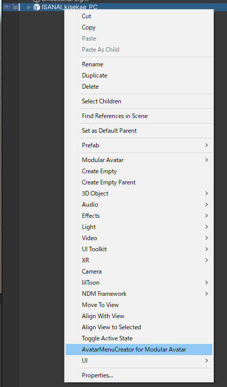

またはメニューから「Tools」→「Modular Avatar」→「AvatarMenuCreator for Modular Avatar」を開いて、ヒエラルキー上のアバターをツールにセット！

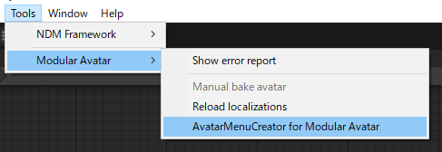

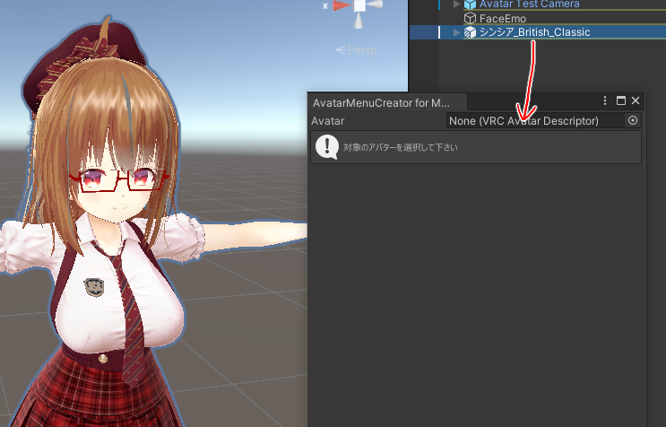

### ②オブジェクトを選ぶ

オブジェクトを選んでといわれるので

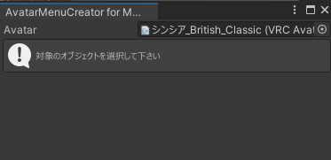

アバター内にある操作したいオブジェクトを選びます。

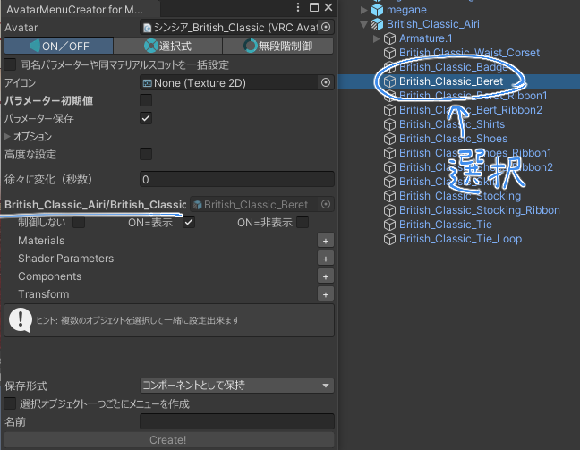

複数のオブジェクトを同時選択して一緒に設定することも可能です。

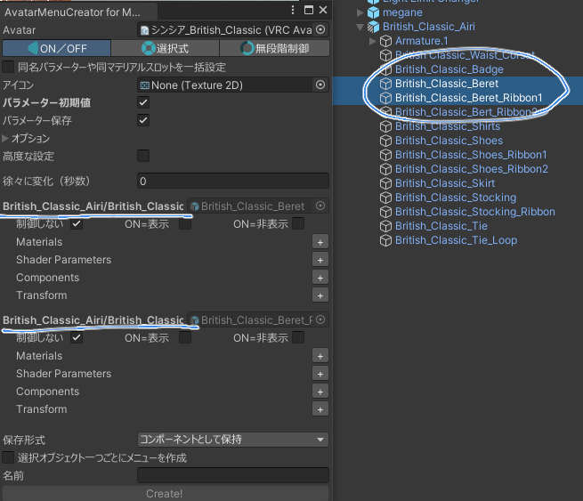

複数のオブジェクトを編集する場合は、「同名パラメーターや同マテリアルスロットを一括設定」をオンにすると便利です。

たとえば最初のオブジェクトで設定を変えるだけで、他のオブジェクトの設定も同時に変更されるようになります。

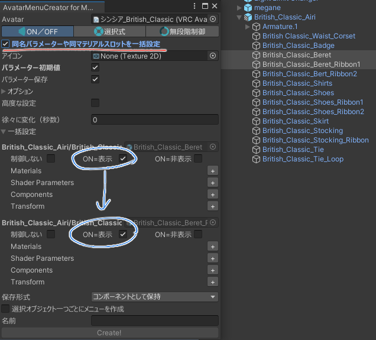

### ③モード選択

好きなモードを選択します。

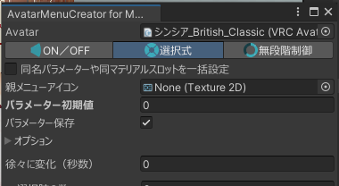

それぞれのモードについての設定は以下のページから見られます。

<LinkCard title="ON/OFF" href="/guides/toggle/" description="ON/OFFのToggleボタンを作るモードです" />
<LinkCard title="選択式" href="/guides/choose/" description="複数の選択肢があるモードです" />
<LinkCard title="無段階制御" href="/guides/radial/" description="BlendShape（シェイプキー）などを無段階に変更出来るモードです" />

### ④設定する

色々設定して……

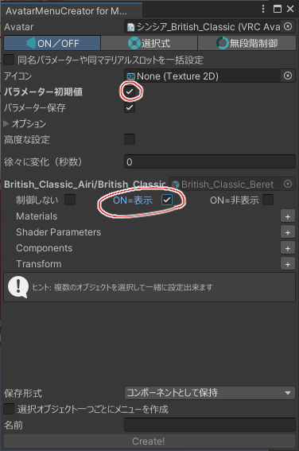

### ⑤Create!で作成

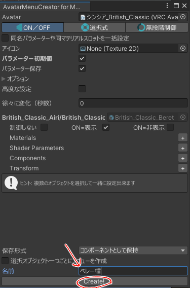

### メニューが出来ます

アバター直下にメニューオブジェクトが出来ます。

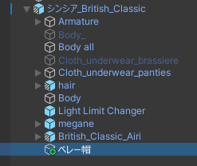

アバター直下以外にも好きな所に入れて大丈夫です。

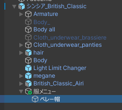

オブジェクトには設定が保存されます。（あとから追加や変更が可能）

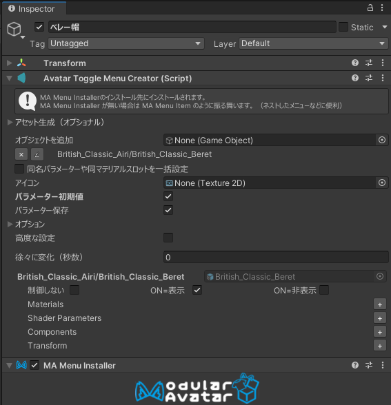

Av3EmulatorやGesture Managerで再生して確認すると、メニューが出来ているはずです。

