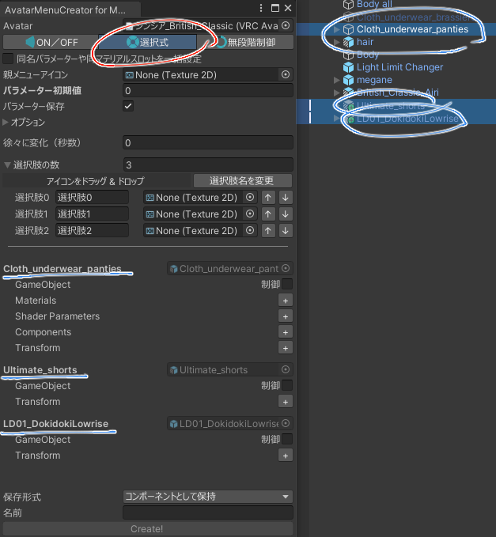
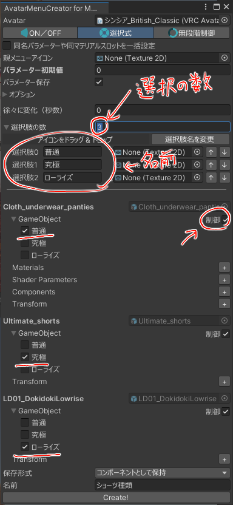
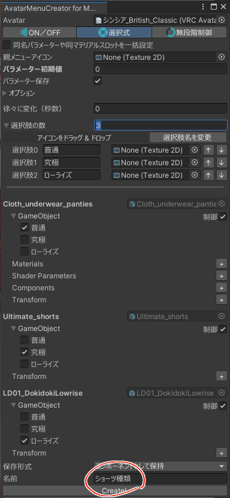
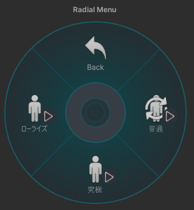

### モードを変えてオブジェクトを選択

モードを「選択式」にします。

変更したいオブジェクトを全部選択します。

### 選択肢を設定

「選択肢の数」とその下の選択肢の名前を設定します。

オブジェクトの横にある「制御」をONにして、それぞれのオブジェクトがどの選択肢で表示されるかを設定します。

### 作成

親メニュー名を決めて「Create!」

選択メニューが完成！

