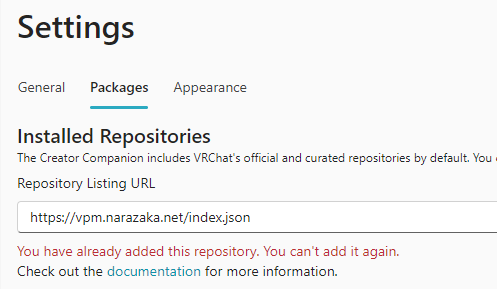

## (推奨)VCC用インストールunitypackageによる方法

1. [VCC用インストールunitypackage](/AvatarMenuCreaterForMA-vcc.unitypackage)をダウンロードします。
2. Unityでunitypackageをインポートします。
   - 以下のいずれかの方法でインポートできます。
      - Unityエディタを開いた状態でunitypackageをダブルクリック
      - Unityエディタにunitypackageをドラッグ&ドロップ
      - Unityエディタのメニューから「Assets」→「Import Package」→「Custom Package...」でunitypackageを選択

## VCCによる方法

1. Modular Avatar https://modular-avatar.nadena.dev/ をインストールします。
2. https://vpm.narazaka.net/ から「Add to VCC」ボタンを押してリポジトリをVCCにインストールします。
3. VCCでSettings→Packages→Installed Repositoriesの一覧中で「Narazaka VPM Listing」にチェックが付いていることを確認します。
4. アバタープロジェクトの「Manage Project」から「AvatarMenuCreatorForMA」をインストールします。

サイト（ https://vpm.narazaka.net ）に行ってもらって

こういうのが出てくるかも

VCCが開くので追加ボタンを押します。

もしかしたら「You have already added this repository. You can't add it again.」というエラーが出るかも知れませんが、これは「既に追加されています！」という意味なので、そのまま次に進みましょう。

アバターのプロジェクトを開いて、下に出てくる一覧からインストール！

## unitypackageによる方法（非推奨）

1. Modular Avatar https://modular-avatar.nadena.dev/ をインストールします。
2. [Releaseページ](https://github.com/Narazaka/AvatarMenuCreaterForMA/releases/latest) から net.narazaka.vrchat.avatar-menu-creater-for-ma-\*.\*.\***-novcc**.zip をダウンロード＆解凍し、unitypackageをアバタープロジェクトにインストールします。
