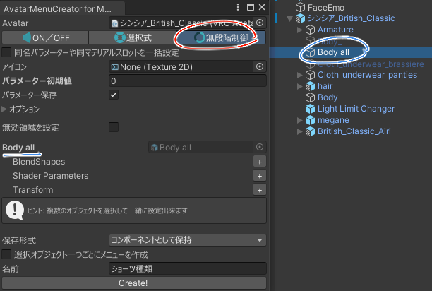
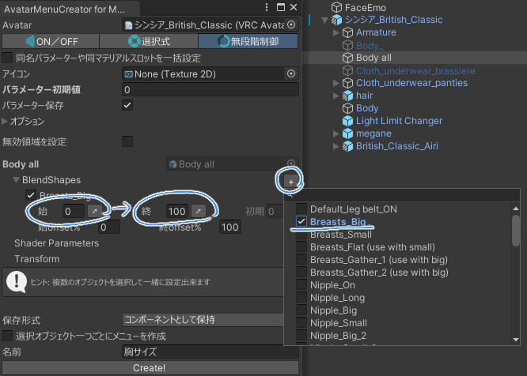
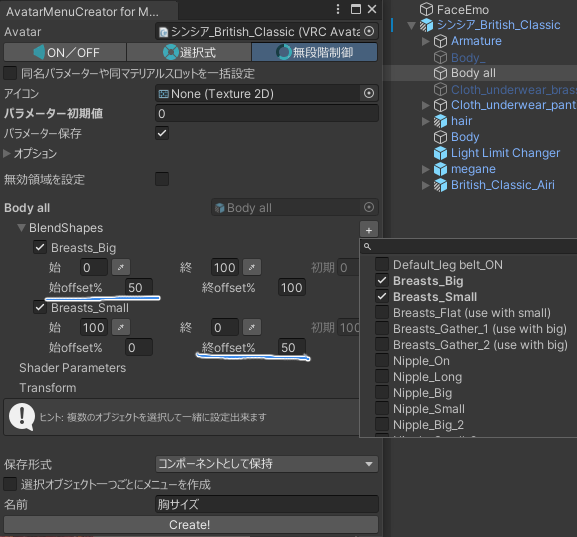
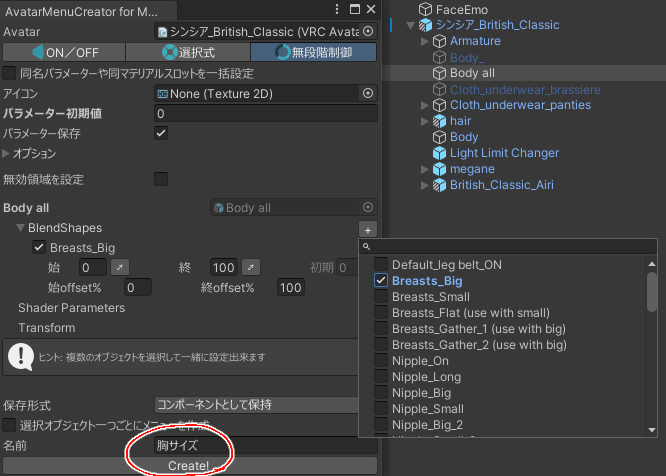
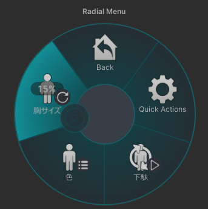

### モードを変えてオブジェクトを選択

モードを「無段階制御」にします。

身体のオブジェクトを選択します。

### 制御の設定

変えたいBlendshape名を選択し、範囲を指定します。

複数のBlendshapeを連動して変えたい場合、offset設定で変化範囲を設定できます。

たとえば0～50%まではBreast_Smallを100→0に、50～100%まではBreast_Bigを0→100にする場合、以下のように設定します。

### 作成

メニュー名を決めてCreate!

Radialメニューが完成！

