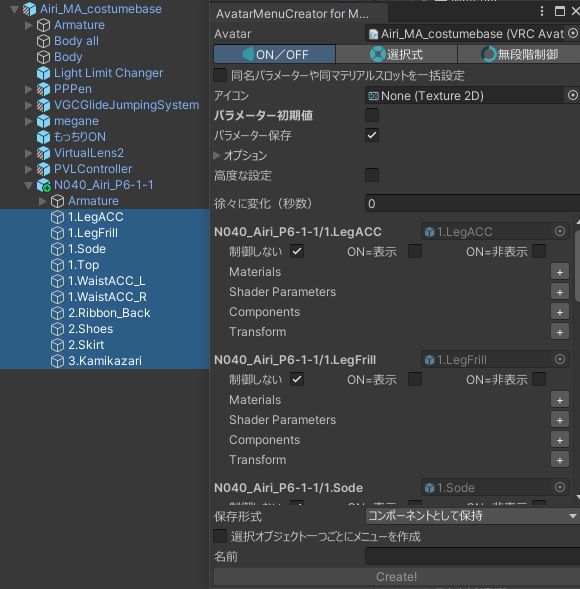
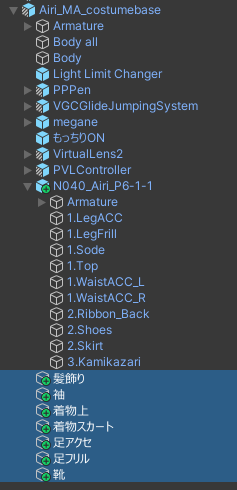

とりあえず服prefabをアバターの中に突っ込んで、Modular Avatar→Setup Outfitとかをやって服を着せます。

Avatar Menu Creatorを開いてアバターを設定した状態で、服の全メッシュを選択します。

- 「同名パラメーターや同マテリアルスロットを一括設定」をON
- パラメーター初期値をON

にします。

どれでもいいので「ON=表示」をクリックすると、全ての項目が「ON=表示」になります。

不要なMA Menu Installerは付けない設定にします。（後で親メニューを作るので）

全部のパーツが別々のメニューで良いなら「選択オブジェクト一つごとにメニューを作成」にチェックを付けて「Create!」

まとめてON/OFFしたいパーツがあるならそこだけ選び直して名前を付けて「Create!」していきます。

選択が変わってもさっき設定した値はウインドウに保持されているので、途中で選択を変えても大丈夫です。

メニューを作り終わったら

メニューの親オブジェクトを作ってその中にメニューを突っ込んで

サブメニューのためのMA Menu Itemを設定して（参考: [メニューをサブメニューにまとめたい](/guides/submenu)）

そこにMA Menu Installerを付ければ

完成です！

