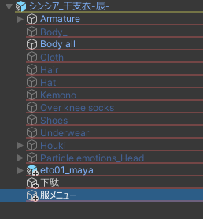
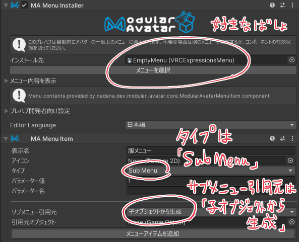
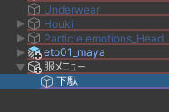

Modular Avatarの機能を使ってメニューをサブメニューにまとめることが出来ます。

### 空オブジェクトを作る

アバターの下に親メニューとなる空オブジェクトを作ります。
（アバターのオブジェクトを右クリックして「Create Empty」）

# Modular Avatarのコンポーネントを追加する

親メニューオブジェクトのInspector上の「Add Component」から`MA Menu Installer`と`MA Menu Item`を付けて、以下のように設定します。

# メニューを移動する

親メニューオブジェクトの子階層にAvatarMenuCreatorで作ったメニューをもってきます

# 不要なコンポーネントを削除

AvatarMenuCreatorでメニューオブジェクトに付いている`MA Menu Installer`を削除します。

（削除して良いというヘルプと削除ボタンが出ているので押して下さい）

# 完成

これでこの階層通りのメニューが出来ます。

