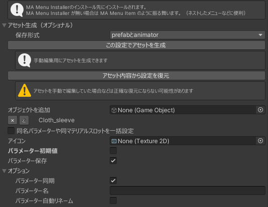
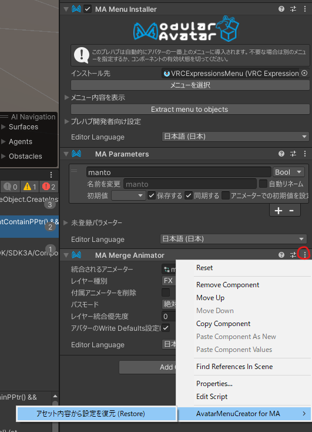

全てのメニュータイプで共通の事項です。

## メニュー設定

メニュー名はGameObject名と同名になります。

### アイコン

メニューのアイコンを指定します。

VRCExpressionsMenuの制約により、256x256より大きいアイコンは指定してもビルドエラーになります。

選択式メニューの場合は親メニューのアイコンになります。

### パラメーター初期値

パラメーターの初期値を設定します。

### パラメーター保存

パラメーターのSavedを設定します。

### パラメーター同期

パラメーターのSyncedを設定します。

### パラメーター名

パラメーター名を設定します。

空の場合は、メニュー名（=GameObject名）と同じになります。

### パラメーター自動リネーム

MA Parametersの「自動リネーム」を設定します。パラメーター名が他とかぶらないことが保証されます。

## UI系

### 同名パラメーターや同マテリアルスロットを一括設定

その時点からの操作が複数のGameObjectに対して同時にされるようになります。

項目の同値判定は以下のようになされます。

- Materials（マテリアルスロット）
  - その時点で同一のマテリアル参照であるマテリアルスロットが一括で操作されます。
- BlendShape
  - 同名のパラメーターが一括で操作されます。
- Shader Parameters
  - 同名のパラメーターが一括で操作されます。
- Components
  - 同種類のコンポーネントの同じパラメーターが一括で操作されます。
- Transform
  - 同種類の項目の同じパラメーターが一括で操作されます。

### 各項目のスポイトボタン

その時点での指定項目の値をコピーして設定します。

## オブジェクト設定（コンポーネントのみ）

Avatar Menu Creatorはオブジェクト参照を絶対パスで保持します。

このためメニューをプレハブにして同一構造の別のアバターに導入してもそのまま動作します。
一方参照先オブジェクトをリネームすると設定の変更が必要になります。

### オブジェクトを追加

シーン上のGameObjectを設定に追加できます。

GameObjectに対して何も設定をしない場合は、インスペクターから離れると追加はなかったことになります。

### オブジェクトの削除（×アイコン）

既に設定されているGameObjectの設定を全て削除します。

### オブジェクトの入れ替え（ペンのアイコン）

既に設定されているGameObjectの参照先を変えられます。

ペンのアイコンを一回押すと編集状態になり、もう一回ペンのアイコンをクリックすると編集がキャンセルされます。

絶対パス名を直接編集してOKボタンを押すか、シーン上のGameObjectを指定することで、設定が別のGameObjectに引き継げます。

絶対パス名には編集時点で存在しないものを設定できます。ビルド時に非破壊に追加されるオブジェクトのパスなどを設定することも出来ます。

## Modular Avatarでの組み込みの挙動

### メニューの組み込み

Avatar Menu Creatorの各コンポーネントは、以下のような方法でMAでメニューを組み込みます。

#### MA Menu ItemおよびMA Menu Groupの配下にある場合

同GameObjectにMA Menu Itemを生成します。

#### MA Menu Installerが同GameObjectにある場合

VRCExpressionsMenuを生成し、MA Menu Installerの「インストールされるメニュー」に指定します。

#### MA Menu ItemおよびMA Menu Groupの配下にあり、かつMA Menu Installerが同GameObjectにある場合

VRCExpressionsMenuを生成し、MA Menu Installerの「インストールされるメニュー」に指定します。

ですがこの場合MA Menu Installerがなくてもインストールが可能なので、「MA Menu Installerを削除」ボタンで削除を促します。

### AnimatorControllerの組み込み

絶対パスでAnimationClipを生成して、MA Merge Animatorを以下の設定で同GameObjectに生成して組み込みます。

- レイヤー種別: FX
- パスモード: 絶対的
- アバターのWrite Defaults設定に合わせる: ON

### パラメーターの組み込み

MA Parametersを同GameObjectに生成して組み込みます。

## メニューの順番

同一のオブジェクトやコンポーネントの同項目を複数のメニューで制御する場合、つねにヒエラルキーの下側にあるメニューが優先されます。

Avatar Menu Creatorはコンポーネントごとに設定通り素朴にアニメーションを作るツールなので、Unityのアニメーションレイヤーの挙動がそのまま現れる形となります。

これを一部回避するための機能として、ON/OFFメニューの「高度な設定」や無段階制御メニューの「無効領域を設定」などがあります。

## アセット生成（オプショナル）

メニューのGameObjectをPrefab化することで使えるようになる機能です。

メニューをビルド時に非破壊に生成するのではなく、エディタ上でAnimatorControllerやAnimationClipなどのアセットを生成してしまう機能です。

操作方法などは[アニメーションを生成していじりたい](/usecases/create-asset)をご覧下さい。

### 保存形式

#### 全て個別に保存

全ての関連アセットを普通に生成します。

AnimatorControllerやAnimationClipなどを手動で編集したい場合におすすめです。

#### prefabとanimator

PrefabアセットにVRCExpressionsMenuを含め、AnimatorControllerにAnimationClipアセットを含むように生成します。

2ファイルで取り回しが良い形式です。

#### 全てprefabに含める

Prefabアセットに全ての関連アセットを含むように生成します。

Prefabの1ファイルで全てが梱包されるのでポータブル性に優れますが、Prefab内がごちゃごちゃします。

### この設定でアセットを生成

上記の保存形式に基づいてアセットを生成します。

### アセット内容から設定を復元

生成したアセットのAnimatorControllerやMA Parametersなどを読み取って、設定内容をコンポーネントに上書きします。

## MA Merge AnimatorおよびMA Parametersの右上「…」メニューから「Avatar Menu Creator for MA」→「アセット内容から設定を復元（Restore）」

上記の「アセット内容から設定を復元」と同じ機能ですが、Avatar Menu Creatorのコンポーネントが無い場合に適切なAvatar Menu Creatorコンポーネントを設定します。

Avatar Menu Creatorで作られたのにコンポーネントがついていないprefab（Avatar Menu Creatorの1.6.2以下で作られた古いprefab等）をコンポーネント形式に移行するための機能です。
