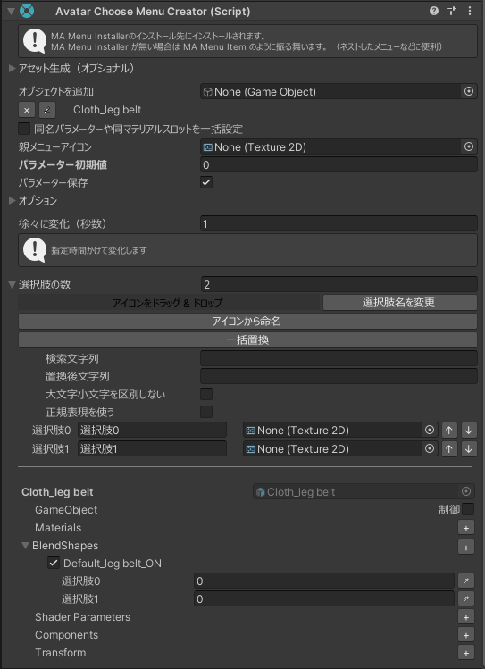

Avatar Choose Menu Creatorコンポーネント特有の設定です。

## パラメーター

パラメーターはInt型で、8bitを消費します。

## パラメーター圧縮

（Avatar Menu Creator>=1.31.0 かつ Compressed Int Parameters>=1.0.0 がインストール済みの場合に利用可能）

パラメーターの必要bit数を必要最小限に削減します。

## 選択肢

選択肢の数を指定し、各選択肢の名前とアイコンを設定します。

### 選択肢名を変更

選択肢名をアセットから一括で指定する機能です。

#### アイコンから命名

アイコンアセットの名前を選択肢名にします。

#### マテリアルから命名

指定されたマテリアルスロットの名前を選択肢名にします。

#### 一括置換

全ての選択肢名を文字列置換します。

## アイコン・マテリアルをドラッグ & ドロップ

Projectビューからアイコン・マテリアルをドラッグ & ドロップで一括設定出来ます。

常に先頭の項目から1つずつ設定されます。

詳細については[マテリアルを変えたい/マテリアルを設定（多い場合）](/usecases/material/#マテリアルを設定多い場合)をご覧下さい。

## GameObjectの設定

「制御」をONにすると1番目の選択肢にチェックが入った状態になります。

全ての選択肢にチェックが無い場合「制御」がOFFになるので、他の選択肢に変えたい場合は他の選択肢のチェックを入れてから元の選択肢のチェックを外してください。

複数の選択肢にチェックを入れることも可能です。

## 徐々に変化

メニューを切り替えたときに、指定秒数かけて変化する設定です。

BlendShape、Shader Parameter、ConstraintのWeightなど、Float型で変化できるものでトランジションを作り込むための機能です。

本機能の挙動は[トランジションさせたい](/usecases/period)をご覧下さい。
