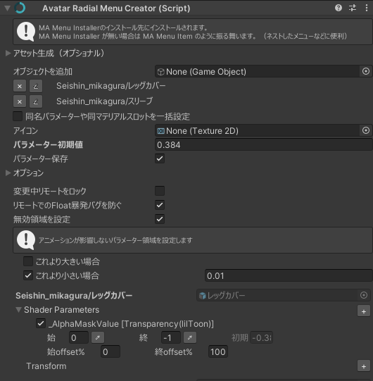

import { LinkCard } from '@astrojs/starlight/components';

共通設定はこちら

<LinkCard title="コンポーネントの共通設定" href="/references/base/" description="全てのメニュータイプで共通の事項です。" />

Avatar Radial Menu Creatorコンポーネント特有の設定です。

## パラメーター

パラメーターはFloat型で、8bitを消費します。

ただし、[Physbone自動リセット](/usecases/components/#physbone自動リセット)・[変更中リモートをロック](#変更中リモートをロック)・[リモートでのFloat暴発バグを防ぐ](#リモートでのfloat暴発バグを防ぐ)のいずれかが有効である場合、Bool型1ビットを追加で消費します。

## 項目の設定

| 項目名 | 内容 |
| ----- | ---- |
| 始 | 始点の値を設定します。 |
| 終 | 終点の値を設定します。 |
| 始offset% | 始点がパラメーター全体の何%地点に置かれるかを設定します。 |
| 終offset% | 終点がパラメーター全体の何%地点に置かれるかを設定します。 |

詳しくは[胸のサイズを変えたい 【無段階制御】/制御の設定](/guides/radial/#制御の設定)をご覧下さい。

## 変更中リモートをロック

RadialMenuを開いている間、リモートでは変更が反映されなくなります。

このオプションが有効な場合、下記の「リモートでのFloat暴発バグを防ぐ」が自動的に満たされます。

## リモートでのFloat暴発バグを防ぐ

VRChatでRadialPuppetを開いた瞬間に、リモートでFloatパラメーターが一瞬1になるバグがあります。

これははるか2021年から存在するバグで、未だに修正されていません。
（[関連Canny: [BUG] Float on a radial open on wrong value remotely | Voters | VRChat](https://feedback.vrchat.com/avatar-30/p/bug-float-on-a-radial-open-on-wrong-value-remotely)）

「リモートでのFloat暴発バグを防ぐ」はこの問題への応急的な対応として、RadialPuppetを開いてから0.3秒間値を固定する機能です。

なおメニューを開いた状態でRadialPuppetを開いた時のバグはこのオプションで防止できますが、RadialPuppetを開いたままリングメニュー自体を閉じて、再度開いた時もこのバグが発生します。これはこの対処では防げません。

## 無効領域を設定

ON/OFFメニューなど他のメニューで同一項目を制御している場合の干渉防止のための項目です。

例えばON/OFFメニューの「徐々に変化」であるGameObjectの透明度を変更してフェードアウトで消す制御を行っているが、そのGameObjectの透明度を手動設定したい場合もある場合に、単に無段階制御メニューを追加すると下側にあるメニューの設定で挙動が上書きされてしまいます。

このとき、パラメーターのデフォルト値付近を無効領域としておくと、パラメーターがその範囲にある時には制御を行わず、別メニューの設定が優先されることになります。

例えば以下のように設定するとデフォルト値付近が無効領域となり、無段階制御メニューをカスタムしたときのみ上書きされるような挙動になります。

- パラメーター初期値が0
  - これより小さい場合=0.01
- パラメーター初期値が1
  - これより大きい場合=0.99
- パラメーター初期値が0.5
  - これより大きい場合=0.49
  - これより小さい場合=0.51
