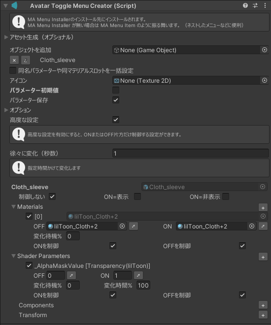

import { LinkCard } from '@astrojs/starlight/components';

共通設定はこちら

<LinkCard title="コンポーネントの共通設定" href="/references/base/" description="全てのメニュータイプで共通の事項です。" />

Avatar Toggle Menu Creatorコンポーネント特有の設定です。

## パラメーター

パラメーターはBool型で、1bitを消費します。

## GameObjectの設定（ON=表示, ON=非表示）

ON=表示の場合、メニューがON（パラメーターがtrue）な時にGameObjectがactiveになります。
ON=非表示の場合、メニューがON（パラメーターがtrue）な時にGameObjectが非activeになります。

## 徐々に変化

メニューがONとOFFを切り替えたときに、指定秒数かけて変化する設定です。

BlendShape、Shader Parameter、ConstraintのWeightなど、Float型で変化できるものでトランジションを作り込むための機能です。

本機能の挙動は[トランジションさせたい](/usecases/period)をご覧下さい。

## 高度な設定

ONまたはOFF片方だけ制御する設定が出来る機能です。

他のメニューで既にON/OFFが制御されているGameObjectに上書きでONまたはOFFを設定したい場合などに利用できます。

またOFF→ONのみ、ON→OFFのみのどちらか片方だけ徐々に変化させたい場合にも使えます。

「ONを制御」の場合、メニューがON（パラメーターがtrue）な時のみ有効なアニメーションが再生状態となります。
メニューがOFF（パラメーターがfalse）の時は何もしないアニメーションが再生状態となります。
「OFFを制御」の場合この逆になります。

### 「徐々に変化」機能との併用

「徐々に変化」によるトランジションアニメーションは「ONへの変化を制御」が有効ならOFF→ON、「OFFへの変化を制御」が有効ならON→OFFが再生されます。

これは「ONを制御」または「OFFを制御」の設定と独立しており、完全にトランジションアニメーションが終了した後に、何もしないアニメーションが再生状態となります。

#### 全て制御されない変化はスキップする

これが有効な場合は

- 「ONへの変化を制御」が全てチェックされていない場合、OFF→ONのトランジションがなくなり即時変化になります。
- 「OFFへの変化を制御」が全てチェックされていない場合、ON→OFFのトランジションがなくなり即時変化になります。

これが無効な場合は

- 「ONへの変化を制御」または「OFFへの変化を制御」が全てチェックされていない時、トランジション時間分何もしないアニメーションが再生されます。

### 注意事項

AnimatorControllerがWrite Defaults OFFで設計されていて、かつ同オブジェクトを設定する別のメニューなどが無い場合にはこの機能を使うべきではありません。

ONまたはOFFになってから別の状態にするアニメーションが存在しないため、ON/OFFが最初に変更したきりその後変わらなくなります。
