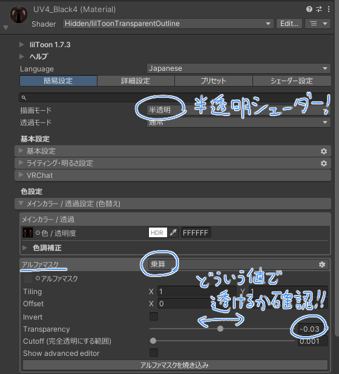
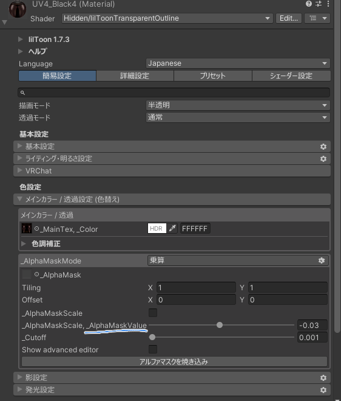
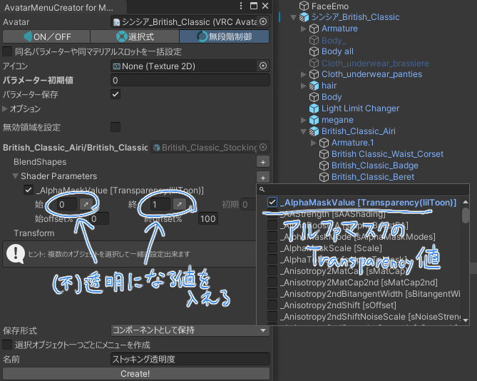

シェーダーのパラメーターを変更することで透明度などを変えることが出来ます。

### マテリアルの値を確認

シェーダーの値を変更するので、シェーダーを半透明にして、どういう値にすると透明になるかを確認します。

liltoonの場合、Altキーを押すとシェーダーパラメーターの名前が表示されます。

### 設定

好きなモードにして透明にしたいオブジェクトを選択します。

変えたいオブジェクトのシェーダーパラメーター名を選択し、範囲を指定してCreate！

### 制限

シェーダーのパラメーターのうち`float`型の値のみ設定出来ます。

Color型などの値は設定出来ないため、liltoonの機能でも一部は使用できません。
