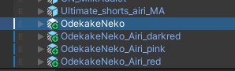
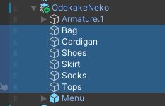
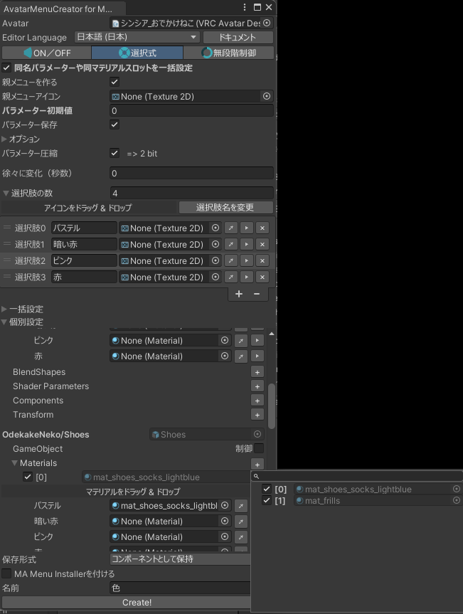
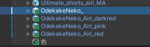
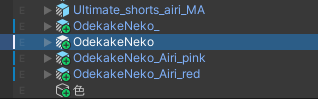
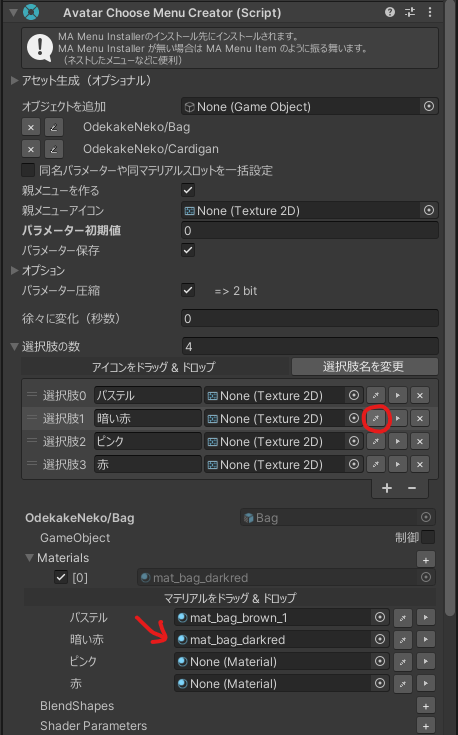
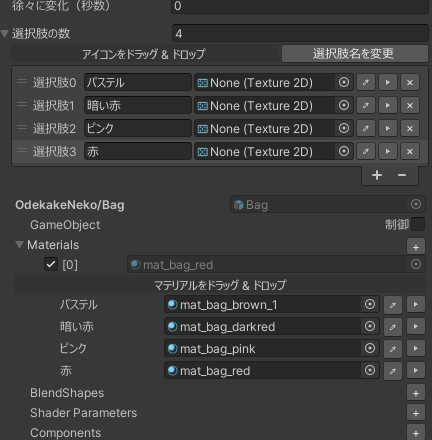
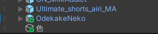

服にカラバリprefabがあるとき、この方法でさくっとカラバリメニューが作れます。

### 1. 入れたいカラーバリエーションのprefabをアバターにいれる

### 2. デフォルト色のprefabのメッシュを選択し、選択肢メニューでマテリアル変更にチェックを入れる

`Materials`の「+」から各メッシュの項目を追加

### 3. 2番目選択肢の色のprefab名をデフォルト色のprefab名にする

デフォルト色prefab名を一旦変えて……

カラバリのprefab名をデフォルト色のものにする

### 4. 選択肢の抽出ボタンを押す

抽出ボタンを押すと当該選択肢の項目に値がコピーされます

### 5. この手順を他の選択肢でも行う

「名前を揃えて抽出ボタンを押す」を繰り返してゆきます。

### 6. 最後にデフォルト色prefabの名前を戻してカラバリprefabを削除する

