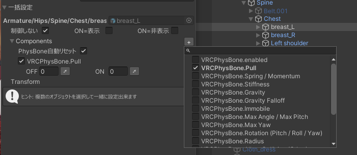

各コンポーネントのチェック（enable）や、VRCPhysBoneや、VRCConstraints等一部コンポーネントが操作できます。

### Physbone自動リセット

PhysBoneの一部プロパティは、PhysBoneを一度無効にして再度有効にしないと反映されません。

「Physbone自動リセット」はこれらの値の変更時に自動でPhysBoneのリセット（無効化→再度有効化）をかける機能です。

