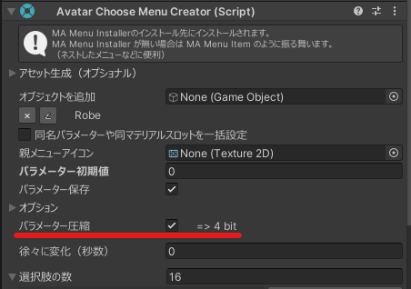

追加ツール **Compressed Int Parameters** を使うと、選択式メニューではパラメーターの必要bit数が必要最小限に削減できるようになります。

- VCCからアバターに「Compressed Int Parameters」をインストールして下さい（Avatar Menu Creatorがインストールされていれば、本ツールも一覧に出るはずです）。
- Avatar Menu Creator は 1.31.0以上にアップデートして下さい。

選択式メニューで「パラメーター圧縮」にチェックを入れると、パラメーターの必要bit数が必要最小限に削減できます。

