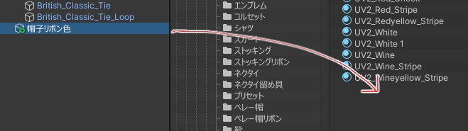
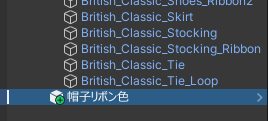

メニューをプレハブにすると、アセット生成機能が使えます。

まずメニューをProjectビューにドラッグ & ドロップしてプレハブを作ります。

シーン上のプレハブにしたメニューを選択します。

「アセット生成（オプショナル）」から「保存形式」を選んで、「この設定でアセットを生成」を押すと、アニメーションやAnimatorControllerが生成されます。 

生成されたアセットは自由に編集できます。
マテリアルの変更などを含む複雑なアニメーション制御を行う場合などに、テンプレートとして使えると思います。
