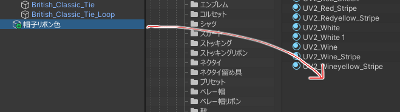
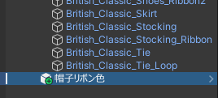
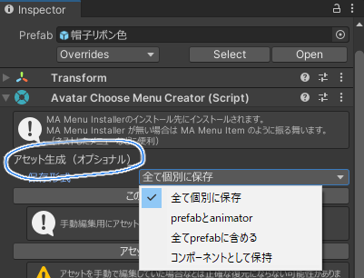

import { LinkCard } from '@astrojs/starlight/components';

メニューをプレハブにすると、アセット生成機能が使えます。

まずメニューをProjectビューにドラッグ & ドロップしてプレハブを作ります。

シーン上のプレハブにしたメニューを選択します。

「アセット生成（オプショナル）」から「保存形式」を選んで、「この設定でアセットを生成」を押すと、アニメーションやAnimatorControllerが生成されます。 

生成されたアセットは自由に編集できます。
マテリアルの変更などを含む複雑なアニメーション制御を行う場合などに、テンプレートとして使えると思います。

### MA Menu Itemがない？

MA Menu InstallerがVRCExpressionsMenuを参照してメニューをインストールする形式の出力になっています。

MA Menu Itemがある方が良い場合は、MA Menu Installerの「Extract menu to objects」ボタンを押してMA Menu Itemを作って下さい。

<LinkCard title="保存形式について" href="/references/base/#保存形式" description="コンポーネントの共通設定" />