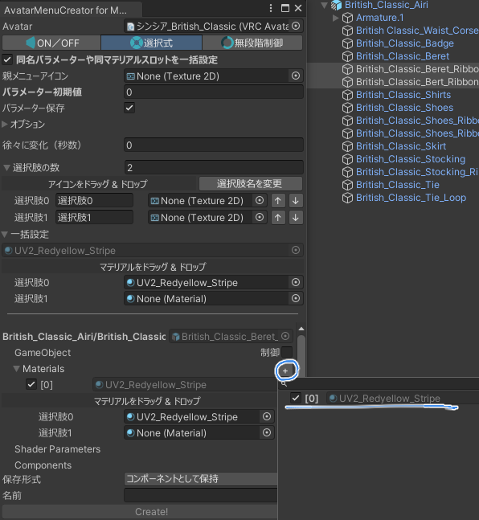
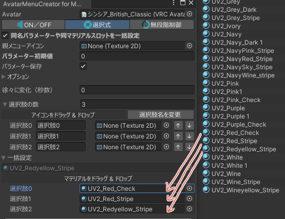
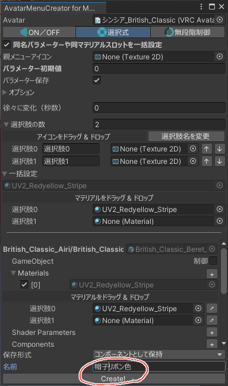
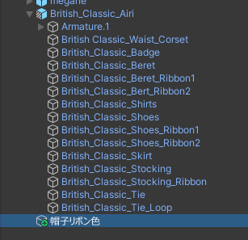
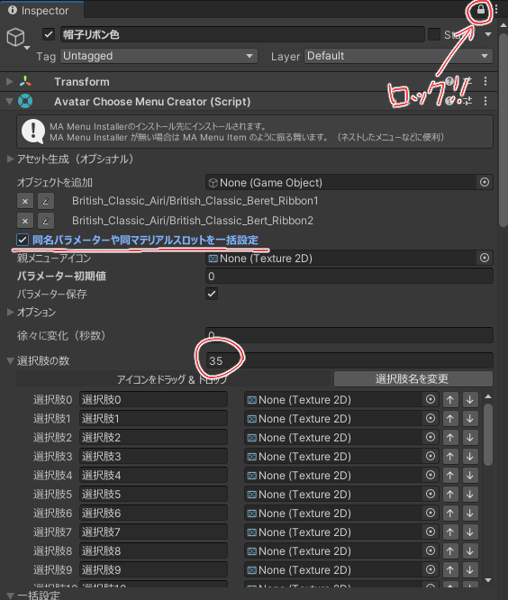
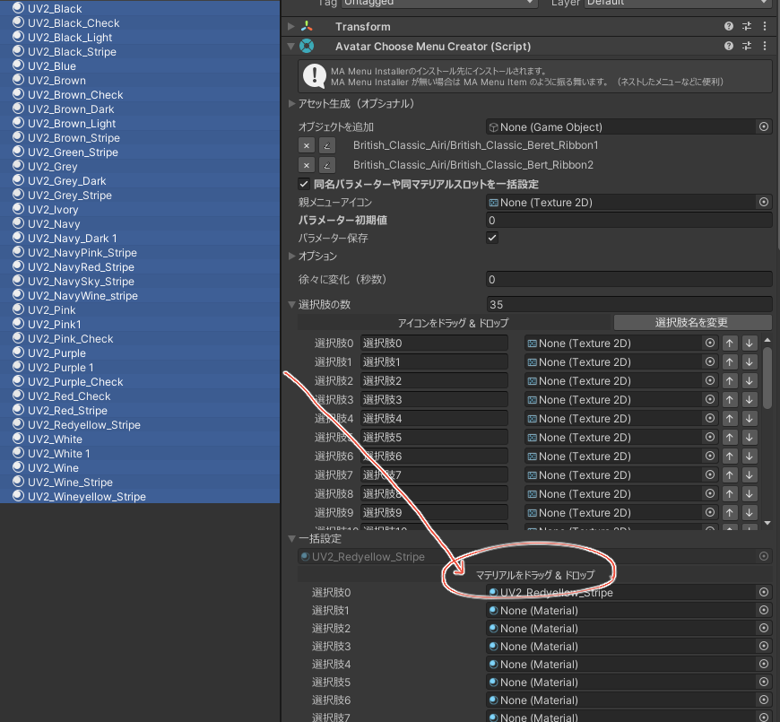
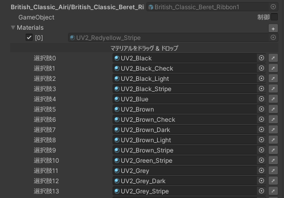
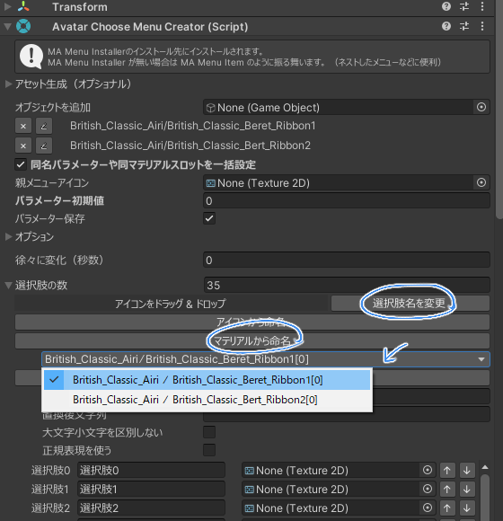
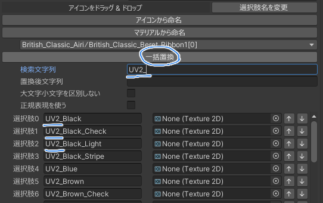
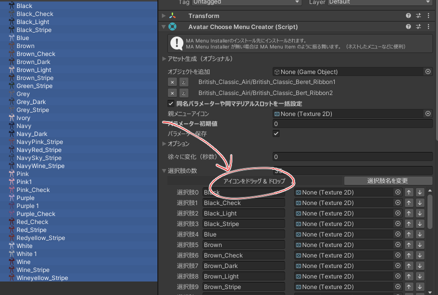

### オブジェクトを選択

変更したいオブジェクトを選択します。

複数のマテリアルを一括変更したい場合は「同名パラメーターや同マテリアルスロットを一括設定」をオンにすると便利です。

### マテリアルスロットを選択

「Materials」の横にある「＋」を押して、マテリアルスロットを選択します。

### マテリアルを設定（少ない場合）

マテリアルが少ない場合は、そのまま1つずつマテリアルを引っ張ってきて設定し、Create!します。

### マテリアルを設定（多い場合）

マテリアルが多くて1つずつ設定するのが面倒な場合は、「マテリアルをドラッグ & ドロップ」機能を使って設定出来ます。

この機能を使うために、いったんマテリアルスロットだけ選択した状態のままメニューを作ってしまいます。

作られたメニューを選択します。

インスペクター右上にあるロックボタンでインスペクターをロックし、選択が変わってもメニューのインスペクターが表示され続けるようにします。
「同名パラメーターや同マテリアルスロットを一括設定」もONにしてください。

選択肢の数も設定します。

マテリアルを選択し、「マテリアルをドラッグ & ドロップ」までドラッグ & ドロップします。

マテリアルが一括で設定されます。

マテリアルから名前も付けてしまいましょう。「選択肢名を変更」ボタンを押して、いずれかのマテリアルスロット（今回は一括設定なのでどれでも一緒）を選んで「マテリアルから命名」を実行します。

接頭辞が不要な場合など名前を一括で変更したい場合は、「一括置換」を使います。

アイコンがある場合はアイコンも一括設定出来ます。

