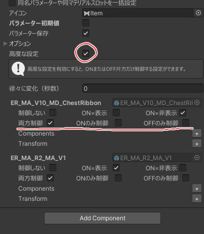

import { LinkCard } from '@astrojs/starlight/components';

ON/OFFメニューにある「高度な設定」を有効にすると、ON時のみ、またはOFF時のみ制御することが可能です。

別のメニューで操作しているものを上書きするメニューなどを作る場合に便利です。

<LinkCard title="高度な設定のリファレンス" href="/references/toggle/#高度な設定" description="ON/OFFメニュー特有の設定" />
