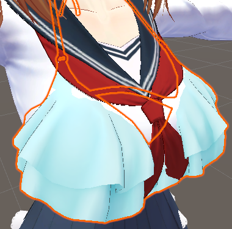

服装ON/OFFメニューの色々な悩み……

- リボンは2つ同時に使わない！

- 別の衣装は同時に出さない！

- 衣装のある部分を消すと衣装の別の部分が成立しない！

これらの解消には、パラメーターの依存関係を定義するのが便利です。

### 追加ツール: Avatar Parameters Driver / Avatar Parameters Exclusive Group

このために条件に応じてパラメーター操作を設定出来るツール**Avatar Parameters Driver**及び**Avatar Parameters Exclusive Group**を使用します。

VCCからアバターに「Avatar Parameters Driver」及び「Avatar Parameters Exclusive Group」をインストールして下さい（Avatar Menu Creatorがインストールされていれば、本ツールも一覧に出るはずです）。

### Avatar Parameters Driverの設定

#### 空のオブジェクトを作る

アバター内に空のオブジェクトを作ります。

#### 「Avatar Parameters Driver」コンポーネントを付ける

そのオブジェクトに「Add Component」から「Avatar Parameters Driver」コンポーネントを付けます。

#### 干渉防止設定

例えば「リボン」と「リボン2」が同時に出ないように設定出来ます。

- 1つめ: 「リボン」がONになったら「リボン2」をOFFにする
- 2つめ: 「リボン2」がONになったら「リボン」をOFFにする

同期メニューを動かす場合、「Local Only」はONにするのがおすすめです。

### Avatar Parameters Exclusive Groupの設定

「オブジェクト同士を1つずつしかONにしない」等の簡単なケースについては、Avatar Parameters Exclusive Groupのほうがよりシンプルに設定出来ます。

#### 空のオブジェクトを作る

アバター内に空のオブジェクトを作ります。

#### 「Avatar Parameters Exclusive Group」コンポーネントを付ける

そのオブジェクトに「Add Component」から「Avatar Parameters Exclusive Group」コンポーネントを付けます。

#### 干渉防止設定

例えば「リボン」と「リボン2」が同時に出ないように設定出来ます。

同時に成立しない条件を列挙すると、自動でそれらが同時に成立しないように制御します。

