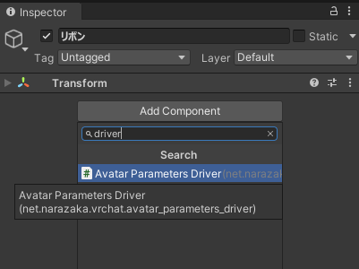
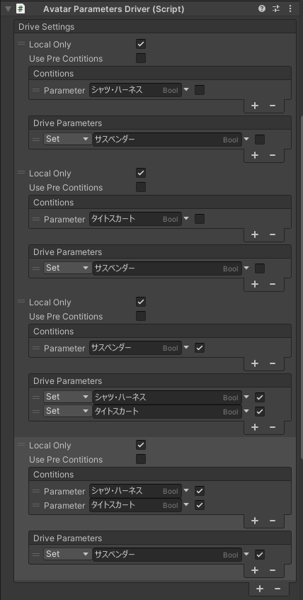

服装ON/OFFメニューの色々な悩み……

- リボンは2つ同時に使わない！

- 別の衣装は同時に出さない！

- 衣装のある部分を消すと衣装の別の部分が成立しない！

- 複数の衣装で同じBlendShapeを使う！

これらの解消には、パラメーターの依存関係を定義するのが便利です。

## 追加ツール: 「Avatar Parameters Driver」 / 「Avatar Parameters Exclusive Group」

このために条件に応じてパラメーター操作を設定出来るツール**Avatar Parameters Driver**及び**Avatar Parameters Exclusive Group**を使用します。

VCCからアバターに「Avatar Parameters Driver」及び「Avatar Parameters Exclusive Group」をインストールして下さい（Avatar Menu Creatorがインストールされていれば、本ツールも一覧に出るはずです）。

### Avatar Parameters Driverの設定例

#### 1. 空のオブジェクトを作る

アバター内に空のオブジェクトを作ります。

#### 2. 「Avatar Parameters Driver」コンポーネントを付ける

そのオブジェクトに「Add Component」から「Avatar Parameters Driver」コンポーネントを付けます。

#### 3. 干渉防止設定

例えば「リボン」と「リボン2」が同時に出ないように設定出来ます。

- 1つめ: 「リボン」がONになったら「リボン2」をOFFにする
- 2つめ: 「リボン2」がONになったら「リボン」をOFFにする

同期メニューを動かす場合、「Local Only」はONにするのがおすすめです。

### Avatar Parameters Exclusive Groupの設定例

「オブジェクト同士を1つずつしかONにしない」等の簡単なケースについては、Avatar Parameters Exclusive Groupのほうがよりシンプルに設定出来ます。

#### 1. 空のオブジェクトを作る

アバター内に空のオブジェクトを作ります。

#### 2. 「Avatar Parameters Exclusive Group」コンポーネントを付ける

そのオブジェクトに「Add Component」から「Avatar Parameters Exclusive Group」コンポーネントを付けます。

#### 3. 干渉防止設定

例えば「リボン」と「リボン2」が同時に出ないように設定出来ます。

同時に成立しない条件を列挙すると、自動でそれらが同時に成立しないように制御します。

## ユースケース

### [排他] AとBを同時に出してはいけないケース

リボンは2つ同時に使わない！

複数の衣装で干渉するパーツがある場合に起こる最もポピュラーなケースです。

上記で示したのと同様の設定で解消可能です。

#### Avatar Parameters Exclusive Groupの設定（おすすめ）

同時に成立しない条件を列挙します。

3つ以上でも基本的に数を増やすだけです。

#### Avatar Parameters Driverの設定

- 1つめ: 「リボン」がONになったら「リボン2」をOFFにする
- 2つめ: 「リボン2」がONになったら「リボン」をOFFにする

3つだと以下のようになり、設定が煩雑になってゆきます。

- 1つめ: 「リボン」がONになったら「リボン2」「リボン3」をOFFにする
- 2つめ: 「リボン2」がONになったら「リボン」「リボン3」をOFFにする
- 3つめ: 「リボン3」がONになったら「リボン」「リボン2」をOFFにする

### [排他セット] AとBのセットとCを同時に出してはいけないケース

セーラー服とセーラー服のリボンは別々に制御できるようにしたまま別の服と排他制御したい！

複数パラメーターをセットで排他処理するのは少し複雑で、Avatar Parameters Driverが必須です。

共通パーツを使い回すようなことがないならば、選択式メニューにしてしまうのが簡単です。

#### Avatar Parameters Driverの設定

セーラー服とセーラーリボンの組と、ワンピースを排他制御するには以下のようにします。

- 1つめ: 「セーラー服」がONになったら「ワンピース」をOFFにする
- 2つめ: 「セーラーリボン」がONになったら「ワンピース」をOFFにする
- 3つめ: 「ワンピース」がONになったら「セーラー服」「セーラーリボン」をOFFにする

### [依存] AがないとBが成り立たないケース

衣装のある部分を消すと衣装の別の部分が成立しない！

服とネクタイやベルトなど、服の付属品等で起こることが多いケースです。

#### Avatar Parameters Exclusive Groupの設定（おすすめ）

同時に成立しない条件を列挙します。

えりがOFFでリボンだけONな状態があり得ないため、以下のようになります。

#### Avatar Parameters Driverの設定

- 1つめ: 「えり」がOFFになったら「リボン」をOFFにする
- 2つめ: 「リボン」がONになったら「えり」をONにする

### [多対一依存] XとYがないとAが成り立たないケース

上下両方の服がないとサスペンダーが成立しない！

接続部品等で良くあるケースです。

#### Avatar Parameters Driverの設定

- シャツ・ハーネスがないならサスペンダーを消す
- タイトスカートがないならサスペンダーを消す
- サスペンダーがあるならシャツ・ハーネスとタイトスカート両方出す
- シャツ・ハーネスとタイトスカートが両方あるならサスペンダーを出す（オプショナル）

複雑な条件指定でもAvatar Parameters Driverなら設定できます。

### [一対多依存] AがないとXまたはYが成り立たないケース

ベルトがないとポーチや警察手帳が宙に浮いてしまう！

服の付属品等で起こることが多いケースです。

#### Avatar Parameters Driverの設定

- 警察手帳があるならベルトを出す
- ポーチがあるならベルトを出す
- ベルトがないならポーチと警察手帳を消す

（実はよく見ると[多対一依存](#多対一依存-xとyがないとaが成り立たないケース)の条件のONとOFFを反転させたものと同じ構造です！）

### [同時依存] 同一数値（BlendShape等）を複数の状態で共有するケース

複数の衣装で同じBlendShapeを使う！

靴等によるハイヒール用BlendShapeやシュリンク用BlendShapeを複数衣装で使うけれど、脱いだ状態も用意したい場合などに発生します。

あえて別メニューにせずに選択式メニューで服とBlendShapeを同時制御するのもおすすめですが、ここではそれぞれ別のON/OFFメニューである場合の制御を解説します。

#### BlendShapeの変更設定

身体のハイヒール状態を変更するON/OFFメニューを作成し、以下のように追加で設定します。

- 「MA Menu Installer」コンポーネントを削除します。
  - 警告が出ますが問題ありません。
  - こうするとメニューが生成されなくなりますが、パラメーターが外部から変更されれば正常に動作します。（参考: [メニューは生成しないようにしたい](/usecases/no-menu/)）

この追加の設定は必須ではありませんが、依存関係によって外部からパラメーターが変更されるので、メニューを作る必要がないのです。

設定しておくとメニューがすっきりするメリットがあります。

#### Avatar Parameters Driverの設定

- 「靴-夏衣装」がONなら「ハイヒール用足」もON
- 「靴-ドレス」がONなら「ハイヒール用足」もON
- 「靴-夏衣装」「靴-ドレス」両方がOFFなら「ハイヒール用足」もOFF

3つ以上になる場合は、「ハイヒール用足」をONにする条件をその衣装分増やして、最後の条件にもその衣装分OFFの条件を追加すると良いです。

#### 同じBlendShapeが複数状態を取り得る場合

例えばハイヒール用BlendShapeの値が靴によって異なるなどのケースです。

この場合は選択式メニューで複数のBlendShapeの変更設定を作ります。

そして以下のようにAvatar Parameters Driverを設定すればOKです。

- 「靴-夏衣装」がONなら「ハイヒール用足」を選択肢1（BlendShape=100）に
- 「靴-白ワンピ」がONなら「ハイヒール用足」を選択肢2（BlendShape=78）に
- 「靴-夏衣装」「靴-白ワンピ」両方がOFFなら「ハイヒール用足」を選択肢0（BlendShape=0）に

### [OR依存] XまたはYがないとCが成り立たないケース

A:乳カーテン（黒）を成立させるためにX:ベルト（赤色）またはY:留め具（青色）が必要

あまり発生しないタイプのような気はします。

#### Avatar Parameters Driverの設定

方針にもよりますが

- ベルトと留め具が両方ないなら乳カーテンを消す
- 乳カーテンが**出現**(OFF→ON)したらベルトと留め具を出す（どちらかでもよいです）

という設定が出来ます。

「**出現**」と記述した条件には「**Pre Conditions**」を指定していることに注意してください。

#### Pre Conditions指定が推奨される場合

ある条件の時（例: 乳カーテン=ONの時）に取り得る状態が複数あるユースケースがあります。

- 例: 乳カーテン=ONの場合
  - 乳カーテンとベルトがON（乳カーテン=ON・ベルト=ON・留め具=OFF）
  - 乳カーテンと留め具がON（乳カーテン=ON・ベルト=OFF・留め具=ON）
  - 全てON（乳カーテン=ON・ベルト=ON・留め具=ON）

こう言うケースでは、「Pre Conditions」を指定して「条件が変化したとき（例: 乳カーテンがOFF→ONになったとき）」という意味の条件指定にするのがおすすめです。

なぜなら、そのアバターを出したまま衣装をメニューで変更しているうちはよいのですが、別のアバターに一旦切り替えてから、そのアバターに切り換え直した場合に以下のように問題が発生する場合があるためです。

##### アバター切り換え時の条件判定

アバターを切り替えた時には、最初に保存されたパラメーターが復元されて、その状態を基準に条件判定がなされます。

例えば上記のケースで「乳カーテンとベルトがON（乳カーテン=ON・ベルト=ON・留め具=OFF）」という状態でパラメーターが保存されていた場合、「Pre Conditions」なしだと「乳カーテン=ON」が条件にひっかかるため、切り換え直後にパラメーターが変更されて留め具もONになってしまいます。

「乳カーテンがOFF→ON」という条件にすれば、保存されたパラメーターは最初から「乳カーテン=ON」であるため条件にひっかからず、メニューから切り替えたときのみ判定されるようになります。
