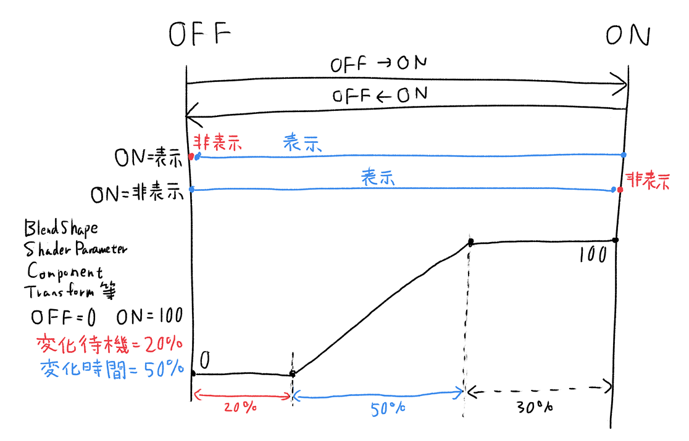

ON/OFFメニューおよび選択式メニューには「徐々に変化（秒数）」という項目があり、これを設定するとON/OFFや選択切り替えの時にトランジションのような効果を付ける事が出来ます。

BlendShape、Shader Parameter、Componentのfloat型パラメーター、Transformなどについて「徐々に変化」要素が設定出来ます。

### 挙動の詳細について

ON/OFFメニューの場合はON/OFFの値の下に「変化待機%」および「変化時間%」という項目が追加されます。

「変化待機%」はトランジションが始まるまでの待機時間です。「変化時間%」はトランジション時間です。OFF→ON方向の変化を基準として設定されます。

GameObjectの表示・非表示設定である「ON=表示」「ON=非表示」は、「徐々に変化（秒数）」中は常にONとなります。

例えば以下のようなパラメーターである場合、

以下のような変化となります。

OFF→ON方向とON→OFF方向では、同じグラフを逆向きにたどることになります。

### 設定例: 透明度変更でフェードしてON/OFF

以下のように透明度変更をしながらON/OFFを切り替えると、フェード効果のようになります。

透明度の変更はレンダーキューを調整しないと内側の服が消えて見えたりする場合があります。適切に調整して設定してください。
