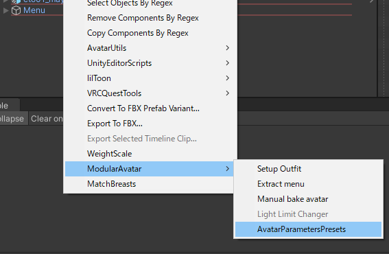
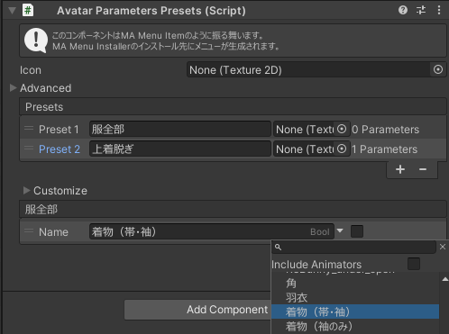
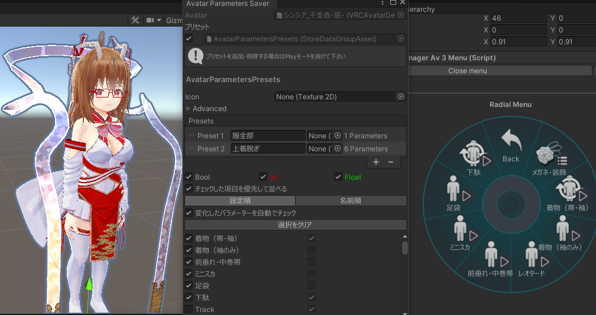
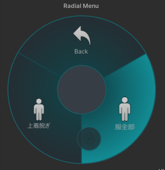

### 追加ツール: Avatar Parameters Saver

追加ツール **Avatar Parameters Saver** を使うと、複数パラメーターをまとめて変更するプリセットメニューが作れます。

VCCからアバターに「Avatar Parameters Saver」をインストールして下さい（Avatar Menu Creatorがインストールされていれば、本ツールも一覧に出るはずです）。

#### プリセットメニューオブジェクトを作る

まずプリセットメニューを作ります

アバター内で右クリックして「Modular Avatar」→「AvatarParametersPresets」でプリセットメニューオブジェクトが作れます。

#### 手動でパラメーターの設定

パラメーターの設定をするとプリセットメニューが作られます。

#### Av3Emulatorと連携して再生時に自動でパラメーター設定

Avatar 3.0 Emulator (Av3Emulator)を使っている場合、シーン再生時に自動でパラメーター設定を収拾できます。

シーン再生中にメニューから「Tools」→「Avatar Parameters Saver」で設定ウインドウを出し、プリセットを選択して下さい。

実際にメニューを操作し状態を確認しながら設定出来ます

再生をやめるとプリセットに値が保持されているはずです。

再度再生するとプリセットメニューが完成しています。

